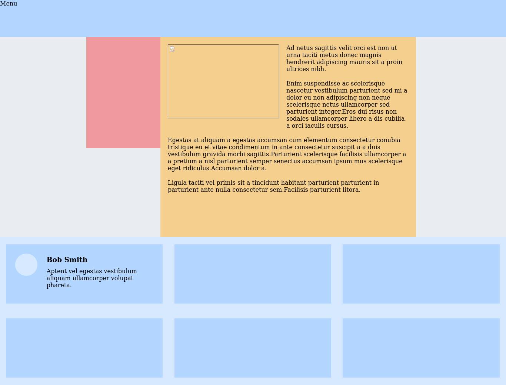

# Interneting Is Hard - Floats

This is a solution to the [Floats tutorial No. 7 of HTML & CSS Is Hard](https://www.internetingishard.com/html-and-css/floats/).

## Table of contents

- [Overview](#overview)
  - [Screenshot](#screenshot)
  - [Links](#links)
- [My process](#my-process)
  - [Built with](#built-with)
  - [What I learned](#what-i-learned)
  - [Continued development](#continued-development)
  - [Useful resources](#useful-resources)
- [Author](#author)
- [Acknowledgments](#acknowledgments)

## Overview

### Screenshot

### Links

- Solution URL: [Floats solution](https://github.com/jugglingdev/floats)
- Live Site URL: [Floats live site](https://jugglingdev.github.io/floats/)

## My process

### Built with

- HTML5
- CSS

### What I learned

This tutorial took a bit of rereading.  Floats are simple enough, but the why's behind some of the behaviors got me.

To align block elements, I can now use `float: left`, `margin: 0 auto`, and `float: right`.  What's weird is that floating an element tells surrounding elements to wrap around the floated element (versus beginning underneath it like when giving an explicit `width` and `height`).

Wrapping is good for magazine-style layouts with images.  But, to get rid of the wrapping, we can have the next element float, too.  This is handy because then the elements stack horizontally (versus vertically without floats).

Clearing a float and hiding overflow both fix the issue of elements flowing around the floated elements before it, correcting the wonky layout.  Use `clear: both` (or left or right) to fix the `height` issue if there's a non-floated element at the bottom of the same container as the floated ones.  Use `overflow: hidden` if there's no non-floated element to make the container recognize the height of its floated elements.

Another use case for `overflow: hidden` is when you want to clear text below a floated image like in the footer grid of this tutorial.  It breaks the magazine-style layout when we need it.

Russian nesting dolls.  That's what I think of when I think of `
` in a `
` in a `
` (or boxes in boxes in boxes).  It's also what we had to do in this tutorial to achieve a full-bleed layout.  This topic makes the most sense to me when I see a mockup layout and label all the boxes I see.

Finally, floats can also be applied to columns and grids, both of which were also explored in this project.

### Continued development

Since this was a highly experimental project, I'd really like to get some experience building out a real project with these different elements.  While floats is a bit old-school, I think it's wise to practice it more since I'm sure to encounter it at some point in my career.

### Useful resources

- [MDN Overflow](https://developer.mozilla.org/en-US/docs/Web/CSS/overflow) - Neat CSS demo for the overflow property.

## Author

- GitHub - [@jugglingdev](https://github.com/jugglingdev)

- freeCodeCamp - [@jugglingdev](https://www.freecodecamp.org/jugglingdev)

- Frontend Mentor - [@jugglingdev](https://www.frontendmentor.io/profile/jugglingdev)

- LinkedIn - [Kayla Paden](https://www.linkedin.com/in/kayla-marie-paden)

## Acknowledgments

Shoutout to Oliver James for his dedication to publishing and maintaining InternetingIsHard.com.  His tutorials were the first that really clicked for me.